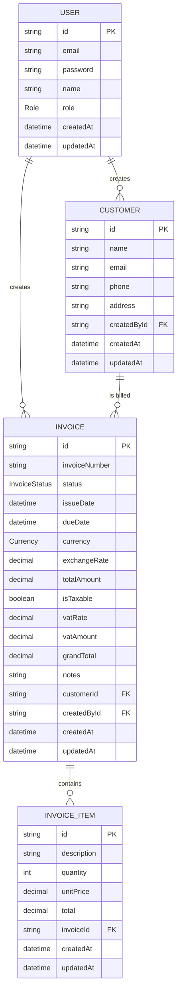

# Entity Relationship Diagram

Generated from [`prisma/schema.prisma`](../prisma/schema.prisma).

## Enums

- **Role**: `ADMIN`, `STAFF`
- **InvoiceStatus**: `DRAFT`, `SENT`, `PAID`, `OVERDUE`, `CANCELLED`
- **Currency**: `IDR`, `USD`

## Notes

- `Invoice.totalAmount` is denormalized (sum of its `InvoiceItem.total` values), recalculated whenever items are added.
- `InvoiceItem` rows are deleted in cascade when their parent `Invoice` is deleted.
- Money fields (`totalAmount`, `unitPrice`, `total`, `vatAmount`, `grandTotal`) use `Decimal(12,2)` to avoid floating-point rounding errors.
- `Invoice.exchangeRate` is the IDR rate per unit of `currency`, snapshotted at invoice creation (always `1` for `IDR`). It is never re-derived from a "current" rate, so revenue figures for existing invoices stay stable even if market rates move.
- `Invoice.vatRate` is the PPN rate snapshotted at creation time (currently `0.11`), for the same reason — changing the standard rate later must not retroactively change historical invoices.
- `Invoice.vatAmount` = `totalAmount * vatRate` when `isTaxable` is true, otherwise `0`. `grandTotal` = `totalAmount + vatAmount`; it is what the customer is actually billed and owes (used for AR/outstanding), whereas `totalAmount` is the pre-tax revenue recognized by the company (PPN collected is a liability to the tax office, not income).
- `isTaxable` defaults to `true` for `IDR` invoices and `false` for non-`IDR` invoices (a heuristic for export-of-services treatment), but can be overridden per invoice while it is still `DRAFT`.
