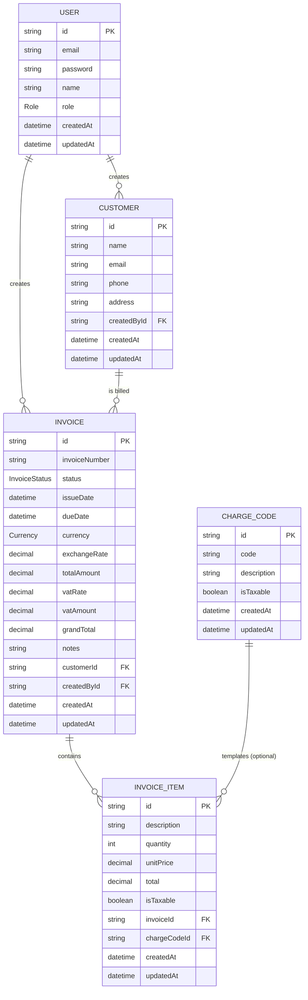

# Entity Relationship Diagram

Generated from [`prisma/schema.prisma`](../prisma/schema.prisma).

## Enums

- **Role**: `ADMIN`, `STAFF`
- **InvoiceStatus**: `DRAFT`, `SENT`, `PAID`, `OVERDUE`, `CANCELLED`
- **Currency**: `IDR`, `USD`

## Notes

- `Invoice.totalAmount` is denormalized (sum of its `InvoiceItem.total` values), recalculated whenever items change.
- `InvoiceItem` rows are deleted in cascade when their parent `Invoice` is deleted. Deleting a `Customer` that still has invoices is blocked with a validation error instead.
- Money fields use `Decimal`, not `Float`, to avoid floating-point rounding errors.
- `Invoice.exchangeRate` and `Invoice.vatRate` are snapshotted at creation time (and can be edited while still `DRAFT`) — they're never re-derived from "current" values later, so past invoices and revenue reports don't shift if market rates or the standard PPN rate change.
- **Tax is per line item, not per invoice.** Each `InvoiceItem.isTaxable` decides whether that line counts toward PPN — a single invoice can mix taxable and zero-rated lines (e.g. a domestic husbandry fee alongside a zero-rated export item). `Invoice.vatAmount` = sum of taxable items' totals × `vatRate`; `grandTotal` = `totalAmount + vatAmount`.
- `Invoice.totalAmount` (pre-tax) is used for "Revenue" reporting — PPN collected isn't company income. `Invoice.grandTotal` (including PPN) is used for "Outstanding"/AR — it's what the customer actually owes.
- **`ChargeCode`** is an optional master list (e.g. `PD001` = "Port dues and harbor fee") used as a template: picking one on an invoice item pre-fills its description and default `isTaxable`, but the link (`InvoiceItem.chargeCodeId`) is optional — items can stay free-text.
