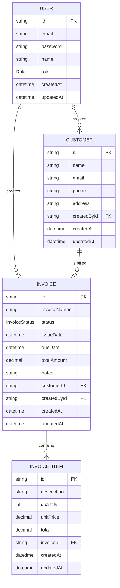

# Entity Relationship Diagram

Generated from [`prisma/schema.prisma`](../prisma/schema.prisma).

## Enums

- **Role**: `ADMIN`, `STAFF`
- **InvoiceStatus**: `DRAFT`, `SENT`, `PAID`, `OVERDUE`, `CANCELLED`

## Notes

- `Invoice.totalAmount` is denormalized (sum of its `InvoiceItem.total` values), recalculated whenever items are added.
- `InvoiceItem` rows are deleted in cascade when their parent `Invoice` is deleted.
- Money fields (`totalAmount`, `unitPrice`, `total`) use `Decimal(12,2)` to avoid floating-point rounding errors.
